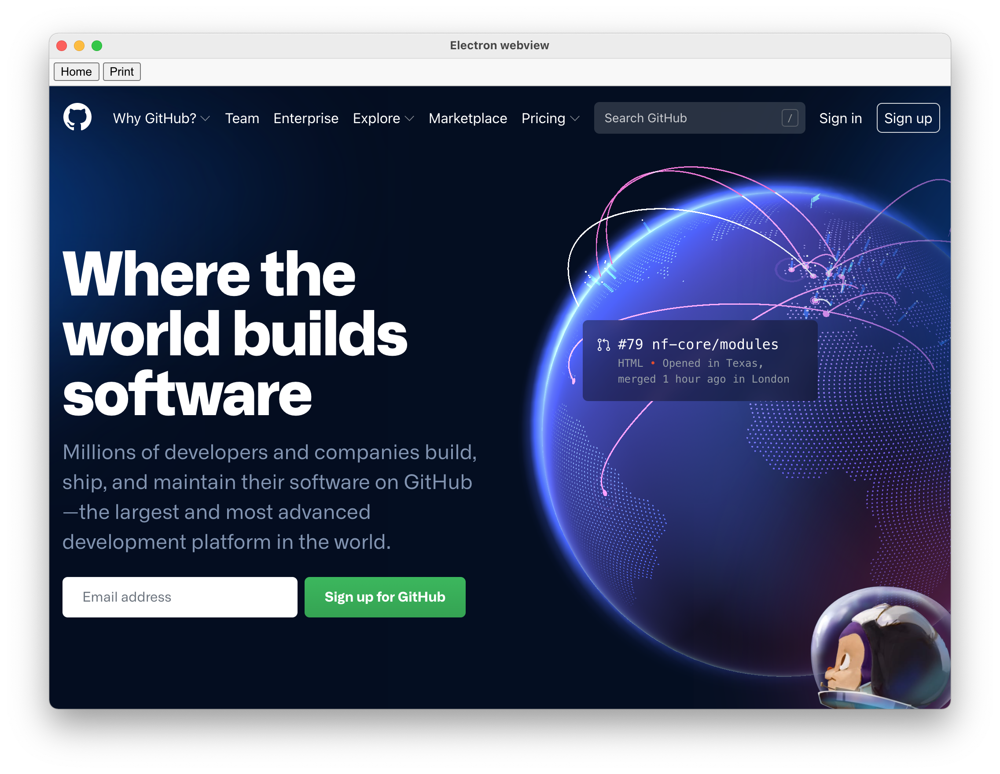

# Electron webview

This is a simple Electron application to create a webview.

Features:

- Responsive window
- Remember the window dimensions when reopening
- Menu & keyboard shortcuts for MacOs
- No title bar
- Home button
- Print function
- MacOS, Windows and Linux executable with an app icon
- DMG installer for Mac



This Electron webview application needs just these files:

- `package.json` - Points to the app's main file and lists its details and dependencies.
- `main.js` - Starts the app and creates a browser window to render website. This is the app's **main process**.
- `index.html` - A web page to render. This is the app's renderer process.
- `assets/` - Assets for the project (style, scripts, icons)

## Usage

To run this repository you'll need [Node.js](https://nodejs.org/en/download/) (which comes with [npm](http://npmjs.com)) installed on your computer. From your command line:

```bash
# Install dependencies
$ npm install
# Run the app
$ npm start
```

### Configuration

You just need to change the `src` attribute of the `webview` in `index.html` file to display the url you want in your webview.

### Developer tools

You can show the developer tools by uncommenting in `main.js` file: `mainWindow.openDevTools();`.

### Title bar

You can show the title bar of the app by setting `frame: true` when creating the window in `main.js` in `mainWindow` variable.

### Window dimensions and responsive

This webview is responsive and supports live dimensions change of the window.
This webview remembers the window size you have before quitting the app to use it when you open it again.

If you want to change the window dimensions at the first start, change `width` and `height` in `main.js` file in `mainWindow` variable when creating the window.

### Menu and keyboard shortcuts

This webview integrates an Electron menu. It will also make standard keyboard shortcuts, like copy and paste, work on MacOS.

You can modify this menu in `main.js` file.

### Topbar (home and print buttons)

A topbar to show buttons:
- "Home" button to come back to your app if your website has external links is included.
- "Print" button to print the current url displayed by the webview.

You can activate/deactivate this topbar (activate by default).

#### Deactivation

##### In `index.html`:

- Comment:
  ```html
  <link rel="stylesheet" href="assets/css/topbar.css">
  ```
  ```html
  <div id="controls">...</div>
  ```

- Uncomment:
  ```html
  <link rel="stylesheet" href="assets/css/no-topbar.css">

  <script src="assets/js/topbar.js"></script>
  ```

##### In `assets/js/webview.js`:

- Comment:
  ```js
  // Topbar functions
  homeButton();
  printButton();
  ```

#### Activation

- Do the opposite of what you did in the activation chapter above.
- Don't forget to set the homepage of your app in the `data-home` attribute of `webview` in `index.html` file to make the "Home" button works.

## Application

To create a MacOS, Windows and Linux executable with an app icon, follow these instructions.

### Electron app icon

For this we need a 1024x1024 png-icon, a .icns for macs and a .ico for windows. For Linux we only need the pngs.

- Create your app icon

- Go to [iConvert Icons](https://iconverticons.com/online/) and upload the PNG and the service will take care of creating the other icon-formats.

- Add your files in `assets/icons`: put the `.icns` file into the `mac` folder, the pngs in the png folder and the `.ico` file in the win folder.<br>Rename the `.icns` and `.ico` files in `icon`.

#### Mac

On Mac, the `.icns` icon converted with iConvert Icons doesn't work.

I recommend using [Image2icon](http://www.img2icnsapp.com), an awesome free app to create and personalize icons from your pictures, available on the Mac Store.

The `.icns` icon converted with Image2icon perfectly works on Mac.

### Electron packager

"[Electron Packager](https://github.com/electron-userland/electron-packager) is a command line tool and Node.js library that bundles Electron-based application source code with a renamed Electron executable and supporting files into folders ready for distribution."

#### Install Electron packager

```bash
# for use in npm scripts
$ npm install electron-packager --save-dev

# for use from cli
$ npm install electron-packager -g
```

#### Application name

Change the `productName` in `package.json`

#### Build MacOS, Windows and Linux package from the terminal

MacOS

```bash
$ electron-packager . --overwrite --platform=darwin --arch=x64 --icon=assets/icons/mac/icon.icns --prune=true --out=release-builds
```

Windows

```bash
$ electron-packager . --overwrite --asar=true --platform=win32 --arch=ia32 --icon=assets/icons/win/icon.ico --prune=true --out=release-builds --version-string.CompanyName=CE --version-string.FileDescription=CE --version-string.ProductName="Electron Webview"
```

Linux (Ubuntu)

```bash
$ electron-packager . --overwrite --platform=linux --arch=x64 --icon=assets/icons/png/1024x1024.png --prune=true --out=release-builds
```

#### Shortcuts

To make it easier to create new builds, scripts are added in `package.json`.

Now you can run:

```bash
$ npm run package-mac
```

```bash
$ npm run package-win
```

```bash
$ npm run package-linux
```

## Mac installer

To create a DMG installer for our Electron app we can use the [electron-installer-dmg](https://github.com/mongodb-js/electron-installer-dmg) package.

To create a DMG installer you first need to package the app as we saw in the Application chapter above.

### Install

```bash
# For use in npm scripts
$ npm install electron-installer-dmg --save-dev

# For use from cli
$ npm install electron-installer-dmg -g
```

### Create the DMG

```bash
$ electron-installer-dmg ./release-builds/Electron\ webview-darwin-x64/Electron\ webview.app electron-webview --out=release-builds --overwrite --icon=assets/icons/mac/icon.icns
```

An `electron-webview.dmg` file is now created in the `release-builds` folder.

### Shortcuts

To make it easier to create new DMG installer, a script is added in `package.json`.

Now you can run:

```bash
$ npm run create-installer-mac
```

## Source

Based on:

- [Electron Packager tutorial](https://www.christianengvall.se/electron-packager-tutorial/)
- [Browser](https://github.com/hokein/electron-sample-apps/tree/master/webview/browser)
- [Printing](https://github.com/hokein/electron-sample-apps/tree/master/printing)

## License

[MIT](LICENSE.md)
